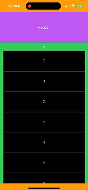

# AccordionHeaderView

A `UIPageViewController`-based project that integrates an **accordion-style header view** with **scrollable pages**.

## 🚀 Features

- **Accordion Header View** 🏗️  
  Dynamically expands and collapses based on scroll interactions.
  
- **Embedded Page View Controller** 📖  
  Manages multiple pages within a single scrollable view.

- **Smooth Scrolling Experience** 🎯  
  Handles scroll direction and content offset calculations for seamless navigation.
  
  

## 📂 Project Structure

```
├── AccordionHeaderView
│   ├── AccordionHeaderView.swift
│   ├── AccordionHeaderViewClient.swift
│   └── AccordionHeaderViewClientVC.swift
├── Example
│   ├── AccordionHeaderViewExample
│   │   ├── AppDelegate.swift
│   │   ├── Assets.xcassets
│   │   ├── Base.lproj
│   │   │   ├── LaunchScreen.storyboard
│   │   │   └── Main.storyboard
│   │   ├── Info.plist
│   │   ├── PageContentViewController.swift
│   │   ├── PageViewController.swift
│   │   ├── SceneDelegate.swift
│   │   └── ViewController.swift
│   ├── AccordionHeaderViewExample.xcodeproj
│   └── Podfile
├── LICENSE
└── README.md
```

## 🛠️ Setup & Installation

1. **Clone the repository**  
   ```sh
   git clone https://github.com/your-username/AccordionHeaderView.git
   cd AccordionHeaderView
   ```
2. **Open in Xcode**  
   - Open `AccordionHeaderView.xcodeproj`
   - Build & run on a simulator or device


3. **Install via CocoaPods**
   ```sh
   pod 'AccordionHeaderView'
   ```
## 📌 Usage

### 1️⃣ **Accordion Header Behavior**
- The `AcordionHeaderViewDelegate` handles dynamic height adjustments as the user scrolls.
- Implemented in `ViewController.swift`.

### 2️⃣ **Page Navigation**
- `PageViewController.swift` manages multiple pages with embedded content.
- `PageContentViewController.swift` populates the scrollable content.

## 📖 Code Overview

### **AcordionHeaderViewDelegate**
```swift
protocol AcordionHeaderViewDelegate: UIViewController {
    var acordionHeaderMinHeight: CGFloat { get }
    var acordionHeaderMaxHeight: CGFloat { get }
    var acordionHeaderHeight: CGFloat { get set }
}
```

### **ViewController (Main Coordinator)**
```swift
override func prepare(for segue: UIStoryboardSegue, sender: Any?) {
    if segue.identifier == "embedPageViewController",
       let pageViewController = segue.destination as? PageViewController {
        pageViewController.acordionHeaderViewDelegate = self
    }
}
```

## 🎨 UI Design
- Uses **Auto Layout** constraints for responsive design.
- `UIStackView` helps in dynamic content rendering.

## 🤝 Contributing
Pull requests are welcome!  
For major changes, please open an issue first to discuss what you’d like to change.

## 📜 License
This project is licensed under the MIT License.

---

### 🚀 Happy Coding!
